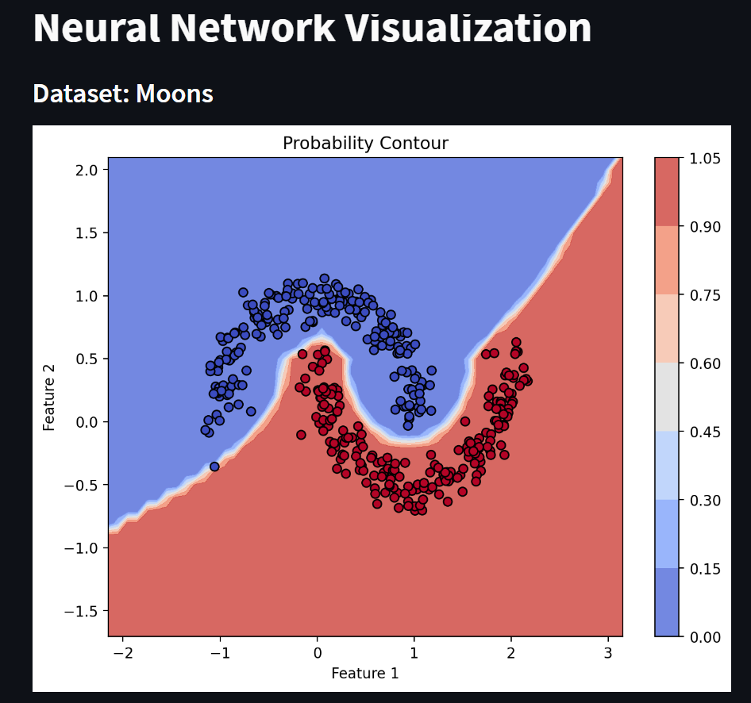
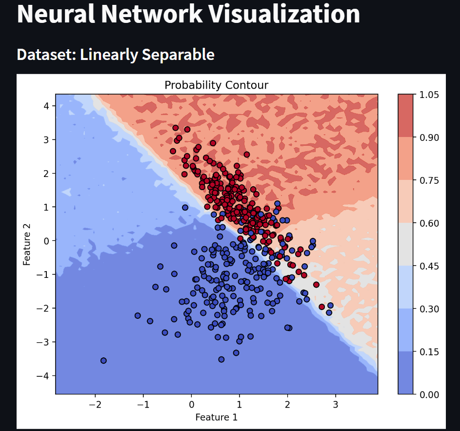

# Task 1

## Problem Statement
Create a streamlit app which has various controls like number of neurons in each layer, lr, epochs etc. and shows the fit on various datasets. It should show the probabilities on the contour plot and not the discrete predictions.<br/>
Have an option of including various transformations to the inputs (basis functions): sine basis. Gaussian basis. Polynomial basis and show the effect of each on the fit via the same contour plots.<br/>
Refer to: https://jakevdp.github.io/PythonDataScienceHandbook/05.06-linear-regression.html <br/>
Find out what is MC dropout method for getting uncertainty. Add an option to enable it in your demo.

## Solution

### Streamlit App

Use command below to run the app
```bash
streamlit run app.py
```

On the left side of the app, there are various controls like number of neurons in each layer, lr, epochs etc. and shows the fit on various datasets. <br/>

After selecting your desired parameter values, click on the `Train Model` button to see the results. (Wait for the model to train it takes a bit of time). The app will show the probabilities on the contour plot. <br/><br />

<br>

If you apply MC Dropout which adds dropout to the neural network during prediction, you can see the uncertainty in the predictions. <br/> This prevents overfitting and gives a better estimate of the uncertainty in the predictions. <br/><br/>


## Dropout in Neural Networks:

Dropout is a regularization technique commonly used in neural networks to prevent overfitting and improve generalization. During training, dropout randomly deactivates a certain percentage of neurons in a layer, effectively creating a smaller and less complex network. This dropout process introduces redundancy and encourages neurons to be more robust and less dependent on specific inputs or connections. By applying dropout during training, the network learns to be more resilient and less sensitive to noise or outliers in the data. During inference or testing, dropout is turned off, and the full network is used for making predictions. Dropout has been shown to be effective in reducing overfitting, leading to better generalization and improved performance on unseen data.

## MC Dropout (Monte Carlo Dropout) in Neural Networks:

MC Dropout is an extension of the dropout technique that offers a way to estimate uncertainty in the predictions made by a neural network. In standard dropout, dropout masks are applied only during training, and dropout is disabled during testing, resulting in deterministic predictions. However, in MC Dropout, dropout is maintained during testing as well. By making multiple forward passes through the network with different dropout masks, MC Dropout allows us to obtain a distribution of predictions rather than a single point estimate. The variance in the predictions reflects the model's uncertainty about its output. MC Dropout can be particularly useful in scenarios where uncertainty estimation is crucial, such as in safety-critical applications or when dealing with limited data. It provides valuable insights into the model's confidence levels and aids in making more informed decisions based on prediction uncertainty.